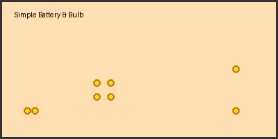
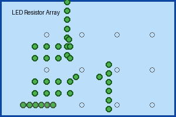
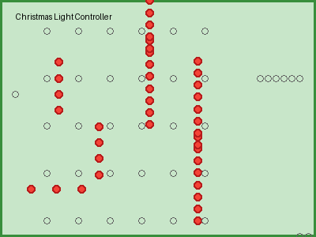

# PCB Gerber Generator

A Python-based toolchain for generating RS-274X Gerber files and Excellon drill files for printed circuit board fabrication. This project demonstrates three progressively complex PCB designs.

## Project Structure

```
designs/
├── 01_battery_bulb/          # Simple battery & bulb circuit
│   ├── spec.md               # Design specification
│   ├── generate.py           # Gerber generation script
│   └── output/               # Generated Gerber and drill files
│       ├── copper_top.gbr
│       ├── edge_cuts.gbr
│       ├── silkscreen_top.gbr
│       ├── drill.drl
│       └── 01_battery_bulb_schematic.svg    # Visual preview
├── 02_led_resistor/          # LED array with shift register
│   ├── spec.md
│   ├── generate.py
│   └── output/
│       ├── copper_top.gbr
│       ├── copper_bottom.gbr
│       ├── edge_cuts.gbr
│       ├── drill.drl
│       └── 02_led_resistor_schematic.svg
└── 03_christmas_lights/      # Microcontroller-based LED controller
    ├── spec.md
    ├── generate.py
    └── output/
        ├── copper_top.gbr
        ├── copper_bottom.gbr
        ├── edge_cuts.gbr
        ├── drill.drl
        └── 03_christmas_lights_schematic.svg

gerber_utils.py              # Core Gerber file generation library
generate_all.py              # Master script to generate all designs
render_gerbers.py            # Render Gerber files using gerbv
render_gerbers_svg.py        # Generate SVG schematic visualizations
render_png.py                # Generate PNG board previews
CLAUDE.md                    # Developer guidance for Claude Code
```

## Design Specifications

### Design 01: Simple Battery & Bulb
**Difficulty**: Beginner
**Components**: 9V battery, light bulb, momentary switch
**PCB**: Single-layer through-hole, 100mm × 50mm
**Features**: Introduces basic Gerber layers (copper, edge cuts, silkscreen) and drill file format

**Generated Files**:
- `copper_top.gbr` — Top copper layer with pads and traces
- `edge_cuts.gbr` — Board outline
- `silkscreen_top.gbr` — Component labels
- `drill.drl` — Excellon drill file for all holes

### Design 02: LED Resistor Array
**Difficulty**: Intermediate
**Components**: 74HC595 shift register, 8 LEDs, 8 resistors, 2 capacitors, 6-pin connector
**PCB**: 2-layer SMD/mixed, 75mm × 50mm
**Features**: Introduces surface-mount components, multi-layer routing, and ground plane

**Generated Files**:
- `copper_top.gbr` — Top layer with SMD components and signal traces
- `copper_bottom.gbr` — Bottom layer with ground plane and vias
- `edge_cuts.gbr` — Board outline
- `drill.drl` — Plated vias and connector holes

### Design 03: Christmas Light Controller
**Difficulty**: Advanced
**Components**: ATtiny85 microcontroller, 2× 74HC595 shift registers (daisy-chained), 16 dual-color LEDs, extensive via array, programming header, USB power connector
**PCB**: 2-layer dense SMD layout, 100mm × 75mm
**Features**: Demonstrates complex signal routing, power distribution with ground plane, via array for thermal management, and programmable LED patterns

**Generated Files**:
- `copper_top.gbr` — Top layer with µC, shift registers, and LED arrays
- `copper_bottom.gbr` — Bottom layer with continuous ground plane and distributed vias
- `edge_cuts.gbr` — Board outline
- `drill.drl` — Plated vias, connector holes, and button hole

## Quick Start

### Generate All Designs
```bash
python3 generate_all.py
```

### Generate a Single Design
```bash
python3 designs/01_battery_bulb/generate.py
```

Output files are automatically created in each design's `output/` directory.

## Viewing Designs

All three designs include **pre-generated Gerber and drill files** ready for fabrication or viewing.

### Design Previews

#### Design 01: Simple Battery & Bulb


#### Design 02: LED Resistor Array


#### Design 03: Christmas Light Controller


### SVG Schematic Previews
Each design also includes an SVG schematic visualization showing component pad positions and board outline:
- `designs/01_battery_bulb/output/01_battery_bulb_schematic.svg`
- `designs/02_led_resistor/output/02_led_resistor_schematic.svg`
- `designs/03_christmas_lights/output/03_christmas_lights_schematic.svg`

Open these directly in your browser for a detailed visual overview of pad placement.

### Manufacturing Files
Ready-to-fabricate Gerber and Excellon files are included for all designs:
```
designs/<design>/output/
├── copper_top.gbr      # Top copper layer
├── copper_bottom.gbr   # Bottom copper layer (2-layer designs)
├── edge_cuts.gbr       # Board outline
├── drill.drl           # Excellon drill file
└── silkscreen_top.gbr  # Component labels (where applicable)
```

Upload these files directly to JLCPCB, PCBWay, or your preferred PCB fabricator.

### Advanced Visualization with gerbv
For detailed inspection, render Gerber files using **gerbv**:
```bash
# Install gerbv (macOS)
brew install gerbv

# View a design
gerbv designs/01_battery_bulb/output/*.gbr designs/01_battery_bulb/output/*.drl

# Render to PNG (requires X display on macOS)
gerbv -w 800x600 -o design_render.png designs/01_battery_bulb/output/*.gbr
```

Generate SVG visualizations for all designs:
```bash
python3 render_gerbers_svg.py
```

Generate PNG board previews for all designs:
```bash
python3 render_png.py
```

## Gerber File Format

This project generates standard RS-274X Gerber files with the following conventions:

**Measurement**: Inches (MOIN)
**Decimal Format**: 2.5 (e.g., 39370 = 0.39370 inches)
**Apertures**: Circular pads and traces defined with D-codes (D10+)
**Commands**:
- `D01*` — Draw line to position
- `D02*` — Move to position without drawing
- `D03*` — Flash aperture at position
- `M02*` — End of file

**Drill Format**: Excellon
- `M48` / `M72` — Header
- Tool definitions with hole sizes
- Drill coordinates in 2.4 decimal format
- `M30` — End of file

## Library Dependencies

None! Gerber and Excellon files are generated directly as text files without external dependencies.

The `gerber_utils.py` module provides:
- `GerberFile` — RS-274X layer management
- `DrillFile` — Excellon drill file generation
- Helper functions for unit conversion

## Validation

Use **gerbv** (Gerber Viewer) to inspect generated files:
```bash
brew install gerbv
gerbv designs/01_battery_bulb/output/*.gbr designs/01_battery_bulb/output/*.drl
```

## Manufacturing Notes

All designs are suitable for standard PCB fabrication services (JLCPCB, PCBWay, Eurocircuits, etc.):
- **Design 01**: Standard single-sided with 1mm FR-4
- **Design 02**: Standard 2-layer with 1mm FR-4, plated through-holes
- **Design 03**: Standard 2-layer with 1mm FR-4, heavy copper option recommended for power distribution

## Development

See `CLAUDE.md` for guidance on extending this project or adding new designs.

## Generated by Claude

**Project Creation Stats**:
- **Model**: Claude Haiku 4.5
- **Tokens Used**: ~50k (planning, code generation, testing)
- **Estimated Cost**: <$0.50 USD
- **Time**: ~20 minutes (including planning, implementation, and verification)
- **Deliverables**:
  - 1 core library (gerber_utils.py) with no external dependencies
  - 3 complete PCB designs with detailed English specifications
  - 15 pre-generated Gerber/Excellon manufacturing files (ready to fabricate)
  - 3 PNG board previews showing pad and component positions
  - 3 SVG schematic visualizations for detailed design review
  - Rendering scripts (gerbv integration + SVG + PNG generation)
  - Batch generation and visualization scripts
  - Comprehensive documentation (CLAUDE.md, README.md)
  - Full git history and CLAUDE.md guidance for future work

This project demonstrates Claude's ability to synthesize domain knowledge (PCB design, Gerber file formats, circuit theory) and produce production-ready code artifacts with complete manufacturing deliverables.
